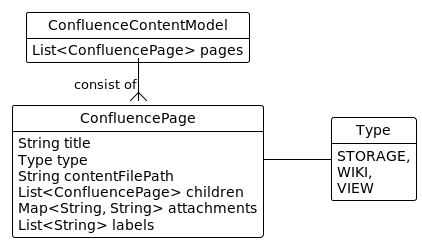

[](https://img.shields.io/badge/STATUS-DEVELOPING-important)
[](https://codecov.io/gh/md2conf/md2conf)

# md2conf toolset

Set of command-line tools to publish markdown files to a Confluence.

Notable features:

- Automatically index input directory to build confluence content model based on file name conventions.
- Avoid limitation of Confluence REST API, that create a new version of a page on every update.
- Highly configurable and extensible by design
- Support markdown features: cross-page links, inline images, etc.

This toolset designed to support "docs-as-code" approach to use markdown
as a docs source and Confluence as a publishing platform.

## Installation

Download latest release from maven central

### Play locally

Need to have:  `java` and `docker` in your PATH, an input directory with markdown files.

Start Confluence locally:

```bash
docker run -p 8090:8090 -p 8091:8091 qwazer/atlassian-sdk-confluence
```

After Confluence starts it will be accessible at http://localhost:8090 with admin:admin credentials.

Run this command

```bash
java -jar md2conf-cli.jar conpub -i=main-application/src/it/resources/several-pages --username=admin --password=admin --space-key=ds -pt="Welcome to Confluence" -url=http://localhost:8090
```

See results at http://localhost:8090/display/ds/Sample

### Publish to remote Confluence instance

Change `url`, `space-key`, `parent-page-title`, `username`, `password` and run new command.

## Main processing steps

1. Index input directory and build page structure based on file name conventions. Each page is a prototype for future
   Confluence Page. Page represented by file path, attachments and children pages.
2. Convert page structure to Confluence Content Model with set of Confluence Pages. Each Confluence Page receive
   confluence-specific attributes like "title", "labels" and "type" ("storage" or "wiki").
3. Publish Confluence Content Model to a Confluence Instance via Confluence REST API.


### Index by file-indexer


### Convert by converters

### Publish using confluence-client


### Confluence Content model

Confluence Content is a collection of Confluence Pages.



#### Confluence Page

Confluence Page has next attributes

| Attribute       | Description                                |
|:----------------|:-------------------------------------------|
| title           | mandatory title                            |
| contentFilePath | mandatory content file path                |
| type            | "storage" or "wiki", see below for details |
| children        | optional collections of child pages        |
| attachments     | optional collections of attachments        |
| labels          | optional collections of labels             |

#### Content Type

Confluence support 2 types of markup "storage" or "wiki" to publish
pages using Confluence API. See Atlassian documentation for details:

* [Confluence Storage Format](https://confluence.atlassian.com/doc/confluence-storage-format-790796544.html)
  \- refered as "storage"
* [Confluence Wiki Markup](https://confluence.atlassian.com/doc/confluence-wiki-markup-251003035.html)
  \- refered as "wiki"


## Usage

### Command-line

```
Usage: md2conf [-v] [COMMAND]
Set of tools to work with 'confluence-content-model': publish, dump, convert.
  -v, --verbose   Increase verbosity.
Commands:
  convert                      Convert files to `confluence-content-model` or
                                 from `confluence-content-model`
  publish                      Publish content to a Confluence instance
  conpub, convert-and-publish  Convert and publish docs to a Confluence instance
  dump                         Dump content from Confluence instance
  help                         Displays help information about the specified
                                 command
'confluence-content-model' is a representation of Confluence page trees and
attachments on a local filesystem. See 'md2conf help model' for details.
```

### History and Motivation

Originally written by Christian Stettler and others as part of
[confluence-publisher](https://github.com/confluence-publisher/confluence-publisher)
tool to publish ascii docs to confluence.

Forked to separate project to use as standalone tool in md2conf toolset.


### License

Copyright (c) 2016-2021 Christian Stettler, Alain Sahli and others.

Copyright (c) 2021-, qwazer.
