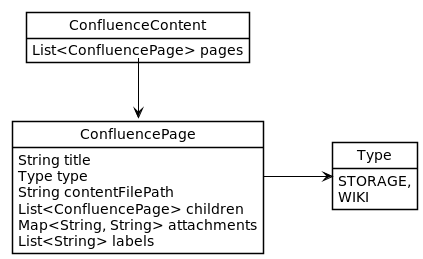

# md2conf toolset

Set of tools to publish/dump confluence content from/to filesystem and
various converters.

This toolset designed to support "docs-as-code" approach to use markdown
as a docs source and Confluence as a publishing platform.

## What's inside?

* **confluence-content-model** - an abstraction to model confluence
  content on a filesystem.
* **converters** - tools to convert directories with files to
  `confluence-content-model` or from `confluence-content-model`
* **confluence-client** - confluence client that utilize Confluence REST
  API for CRUD operation with content in a Confluence instance. It allow

## confluence-client

**confluence-client** is a Java based confluence client that utilize
Confluence REST API to create/update/delete content in a Confluence
instance. It uses own domain model to describe Confluence content in
json file. It is a part of md2conf toolset.

### Confluence Content model

Confluence Content is a collection of Confluence Pages.




### Confluence Page

Confluence Page has next attributes

| Attribute       | Description                                |
|:----------------|:-------------------------------------------|
| title           | mandatory title                            |
| contentFilePath | mandatory content file path                |
| type            | "storage" or "wiki", see below for details |
| children        | optional collections of child pages        |
| attachments     | optional collections of attachments        |
| labels          | optional collections of labels             |

#### Content Type

Confluence support 2 types of markup "storage" or "wiki" to publish
pages using Confluence API. See Atlassian documentation for details:

* [Confluence Storage Format](https://confluence.atlassian.com/doc/confluence-storage-format-790796544.html)
  \- refered as "storage"
* [Confluence Wiki Markup](https://confluence.atlassian.com/doc/confluence-wiki-markup-251003035.html)
  \- refered as "wiki"

### Example

TODO

<!--TODO add example-->

## Usage

### Command-line

```
Usage: md2conf [COMMAND]
Set of tools to publish/dump confluence content from/to filesystem and various
converters
Commands:
  convert                      Convert files using specified converter
  publish                      Publish content to a Confluence instance
  conpub, convert-and-publish  Convert and publish docs to a Confluence instance
  dump                         Dump content from Confluence instance
  help                         Displays help information about the specified
                                 command
```

### History and Motivation

Originally written by Christian Stettler and others as part of
[confluence-publisher](https://github.com/confluence-publisher/confluence-publisher)
tool to publish ascii docs to confluence.

Forked to separate project to use as standalone tool in md2conf toolset.

Plan to add next features:

* Support for Confluence Wiki Markup content type
* Externalized configuration
* Command line interface
* Performance optimizations for idempotency feature


### License

Copyright (c) 2016-2021 Christian Stettler, Alain Sahli and others.

Copyright (c) 2021-, qwazer.
