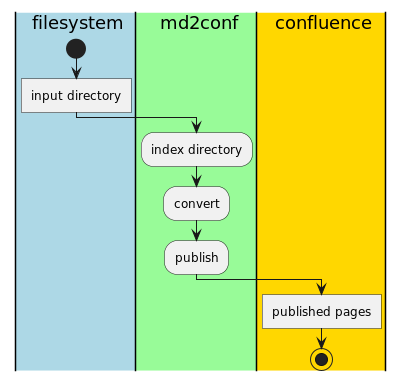
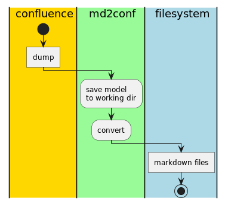

[](https://search.maven.org/artifact/io.github.md2conf/md2conf-cli)
[](https://codecov.io/gh/md2conf/md2conf)


[TOC]: # "md2conf toolset"

# md2conf toolset
- [Overview](#overview)
- [Installation](#installation)
  - [Play locally](#play-locally)
  - [Publish to remote Confluence instance](#publish-to-remote-confluence-instance)
- [Usage](#usage)
  - [Command-line](#command-line)
  - [Maven plugin](#maven-plugin)
- [How it works inside?](#how-it-works-inside)
  - [Index by file-indexer](#index-by-file-indexer)
  - [Convert by converters](#convert-by-converters)
  - [Publish using confluence-client](#publish-using-confluence-client)
  - [Confluence Content model](#confluence-content-model)
- [Markdown extensions](#markdown-extensions)
  - [Confluence macros](#confluence-macros)
  - [Cross-page links between markdown pages](#cross-page-links-between-markdown-pages)
  - [Image attachments](#image-attachments)
  - [Link to local file](#link-to-local-file)
  - [Confluence supported languages in fenced code blocks](#confluence-supported-languages-in-fenced-code-blocks)
- [History and motivation](#history-and-motivation)
  - [Regards](#regards)
  - [License](#license)


## Overview

Set of command-line tools to publish markdown files to a Confluence or
dump Confluence content as markdown files with attachments.

Notable features:

- Automatically index input directory to build confluence content model
  based on file name conventions.
- Idempotence confluence client. Avoid limitation of Confluence REST
  API, that create a new version of a page on every update.
- Support cross-page links between markdown pages, inline images, etc.
- Dump Confluence pages and convert to local markdown files
  (experimental feature with initial support)
- Extensible by design

This toolset designed to support "docs-as-code" approach to use markdown
as a docs source and Confluence as a publishing platform.

## Installation

Download the latest release from maven central

### Play locally

Need to have: `java` and `docker` in your PATH, an input directory with
markdown files.

Start Confluence locally:

```bash
docker run -p 8090:8090 -p 8091:8091 qwazer/atlassian-sdk-confluence
```

After Confluence starts it will be accessible at http://localhost:8090
with admin:admin credentials.

Run next command

```bash
java -jar md2conf-cli.jar conpub -i=main-application/src/it/resources/several-pages --username=admin --password=admin --space-key=ds -pt="Welcome to Confluence" -url=http://localhost:8090
```

See results at http://localhost:8090/display/ds/Sample

### Publish to remote Confluence instance

Change `url`, `space-key`, `parent-page-title`, `username`, `password`
in the command above and run.


## Usage

### Command-line

```
Usage: md2conf [-v] [COMMAND]
Set of tools to work with 'confluence-content-model': publish, dump, convert.
  -v, --verbose   Increase verbosity.
Commands:
  convert                      Convert files to `confluence-content-model` or
                                 from `confluence-content-model`
  publish                      Publish content to a Confluence instance
  conpub, convert-and-publish  Convert and publish docs to a Confluence instance
  dump                         Dump content from Confluence instance and save
                                 as 'confluence-content-model' with files in
                                 Confluence VIEW format
  dumpcon, dump-and-convert    Dump content from Confluence instance, convert
                                 using VIEW2MD converter to directory tree with
                                 markdown files and binary attachments
  help                         Display help information about the specified
                                 command.
'confluence-content-model' is a representation of Confluence page trees and
attachments on a local filesystem. See 'md2conf help model' for details.
```


### Maven plugin

```xml
<plugin>
    <groupId>io.github.md2conf</groupId>
    <artifactId>md2conf-maven-plugin</artifactId>
    <!--            <version>SPECIFY version here</version>-->
    <executions>
        <execution>
            <goals>
                <goal>conpub</goal>
            </goals>
        </execution>
    </executions>
    <configuration>
        <inputDirectory>docs/markdown</inputDirectory>
        <indexerRootPage>index.md</indexerRootPage>
        <titleChildPrefixed>true</titleChildPrefixed>
        <confluenceUrl>https://some-confluence-url</confluenceUrl>
        <username>admin</username>
        <password>admin</password>
        <spaceKey>DS</spaceKey>
        <parentPageTitle>Welcome to Confluence</parentPageTitle>
        <skipSslVerification>true</skipSslVerification>
    </configuration>
</plugin>
```


## How it works inside?

Main publish-and-convert steps are

1. Index input directory and build page structure based on file name
   conventions. Each page is a prototype for future Confluence Page.
   Page represented by file path, attachments and children pages.
2. Convert page structure to Confluence Content Model with set of
   Confluence Pages. Each Confluence Page receive confluence-specific
   attributes like "title", "labels" and "type" ("storage" or "wiki").
3. Publish Confluence Content Model to a Confluence Instance via
   Confluence REST API.



Main dump-and-convert steps are

1. Dump Confluence Content Model identified by user-provided parent page
   to temp working directory `.md2conf`
2. Convert it using MD2VIEW converter. MD2VIEW converter build on top of
   `flexmark` `html2md` converter.




### Index by file-indexer

File-indexer is a tool that build Confluence Content Model based on file
name conventions.

There are 2 types of relation between confluence objects 'child
relation' and 'attachment relation'

#### Filename conventions

| Relation              | Filename convention                                                                                                                                                    | Example                                               |
|:----------------------|:-----------------------------------------------------------------------------------------------------------------------------------------------------------------------|:------------------------------------------------------|
| 'child relation'      | Child page of parent page `parent.md` must be located in directory with basename of parent page (`./parent`)                                                           | 2 files: `parent.md` and `parent/child.md`            |
| 'attachment relation' | Attachment file of page `page.md` must be located in directory which name is concatenation of basename of parent page and "_attachments" suffix (`./page_attachments`) | 2 files: `page.md` and `./page_attachments/image.png` |


Controlled by properties:

| Property key    | CLI name            | Description                                                                                                                 | Default value |
|:----------------|:--------------------|:----------------------------------------------------------------------------------------------------------------------------|:--------------|
| inputDirectory  | "-i", "--input-dir" | Input directory                                                                                                             |               |
| fileExtension   | --file-extension    | File extension to index as confluence content pages                                                                         | md            |
| excludePattern  | --exclude-pattern   | Exclude pattern in format of glob:** or regexp:.*. For syntax see javadoc of java.nio.file.FileSystem.getPathMatcher method | "glob:**/.*"  |
| indexerRootPage | --indexer-root-page | Use specified page as parent page for all another top-level pages in an input directory                                     |               |


### Convert by converters

Controlled by properties:

| Property key           | CLI name                     | Description                                                                                                                                                                            | Default value     |
|:-----------------------|:-----------------------------|:---------------------------------------------------------------------------------------------------------------------------------------------------------------------------------------|:------------------|
| converter              | --converter                  | Converter. Valid values are MD2WIKI, COPYING, NO, VIEW2MD                                                                                                                              | MD2WIKI           |
| outputDirectory        | "-o", "--output-dir"         | Output directory                                                                                                                                                                       |                   |
| titleExtract           | --title-extract              | Strategy to extract title from file, FROM_FIRST_HEADER or FROM_FILENAME                                                                                                                | FROM_FIRST_HEADER |
| titlePrefix            | --title-prefix               | Title prefix common for all pages                                                                                                                                                      |                   |
| titleSuffix            | --title-suffix               | Title suffix common for all pages                                                                                                                                                      |                   |
| titleChildPrefixed     | --title-child-prefixed       | Add title prefix of root page if page is a child                                                                                                                                       | false             |
| titleRemoveFromContent | --title-remove-from-content  | Remove title from converted content, to avoid duplicate titles rendering in an Confluence                                                                                              | false             |
| plantumlCodeAsMacro    | --plantuml-code-macro-enable | Render markdown plantuml fenced code block as confluence plantuml macro (server-side rendering)                                                                                        | false             |
| plantumlCodeMacroName  | --plantuml-code-macro-name   | Name of confluence macro to render plantuml. Need to Confluence plugin. Possible known options are: 'plantuml' or 'plantumlrender' or 'plantumlcloud'. By default, 'plantuml' is used. | plantuml          |


The result of conversion saved in output directory file
`confluence-content-model.json`'.


### Publish using confluence-client

Controlled by properties:

| Property key                 | CLI name                           | Description                                                                                                     | Default value                    |
|:-----------------------------|:-----------------------------------|:----------------------------------------------------------------------------------------------------------------|:---------------------------------|
| confluenceUrl                | "-url", "--confluence-url"         | The root URL of the Confluence instance                                                                         |                                  |
| username                     | "--username"                       | Username of the Confluence user                                                                                 |                                  |
| password                     | "--password"                       | The password or personal access token of the user. In case of using token don't specify username.               |                                  |
| spaceKey                     | "-s", "--space-key"                | The password or personal access token of the user                                                               |                                  |
| parentPageTitle              | "-pt", "--parent-page-title"       | The parent page to publish `confluence-content-model`                                                           |                                  |
| skipSslVerification          | --skip-ssl-verification            |                                                                                                                 | false                            |
| maxRequestsPerSecond         | --max-requests-per-second          |                                                                                                                 |                                  |
| connectionTimeToLive         | --connection-time-to-live          | Connection TTL. Useful in case a server is configured to have a very low TTL to keep existing connectings alive |                                  |
| orphanRemovalStrategy        | --orphan-removal-strategy          | REMOVE_ORPHANS or KEEP_ORPHANS                                                                                  | KEEP_ORPHANS                     |
| parentPagePublishingStrategy | --parent-page-publishing-strategy  | APPEND_TO_ANCESTOR or REPLACE_ANCESTOR                                                                          | APPEND_TO_ANCESTOR               |
| notifyWatchers               | --notify-watchers                  |                                                                                                                 | false                            |
| versionMessage               | --version-message                  |                                                                                                                 | Published by md2conf             |
| confluenceContentModelPath   | "-m", "--confluence-content-model" | Path to file with `confluence-content-model` JSON file.                                                         | '.confluence-content-model.json' |


### Confluence Content model

Confluence Content is a collection of Confluence Pages. It represented
in file `confluence-content-model.json` in local filesystem.


#### Confluence Page

Confluence Page has next attributes

| Attribute       | Description                                |
|:----------------|:-------------------------------------------|
| title           | mandatory title                            |
| contentFilePath | mandatory content file path                |
| type            | "storage" or "wiki", see below for details |
| children        | optional collections of child pages        |
| attachments     | optional collections of attachments        |
| labels          | optional collections of labels             |

#### Content Type

Confluence support 2 types of markup "storage" or "wiki" to publish
pages using Confluence API. See Atlassian documentation for details:

* [Confluence Storage Format](https://confluence.atlassian.com/doc/confluence-storage-format-790796544.html)
  \- referred as "storage"
* [Confluence Wiki Markup](https://confluence.atlassian.com/doc/confluence-wiki-markup-251003035.html)
  \- referred as "wiki"

Additional VIEW html-like format used to render pages. It used only in
dump functionality.

## Markdown extensions

### Confluence macros

Html inline comments with <!-- { } --> treated as Confluence macros. For
list of Confluence macros see
https://support.atlassian.com/confluence-cloud/docs/what-are-macros/ and
section "Wiki markup example" on particular macros. A couple of useful
are
[table-of-contents-macro](https://support.atlassian.com/confluence-cloud/docs/insert-the-table-of-contents-macro/)
and
[children-display-macro](https://support.atlassian.com/confluence-cloud/docs/insert-the-children-display-macro/)


Also see
[confluence_macro_spec_test](converters/flexmark-ext-confluence-macro/src/test/resources/confluence_macro_spec_test.md)


### Cross-page links between markdown pages

In case of markdown file has content that refer to another markdown
file, that exists in page structure the reference will be converted to
valid Confluence page reference.

For examples see
[crosspage_link_title_spec_test](converters/flexmark-ext-crosspage-link/src/test/resources/crosspage_link_title_spec_test.md)


### Image attachments

Markdown image will be converted to a Confluence Image. If markdown
image has link to local file, it will be converted to Confluence
attachment and uploaded to a Confluence server.

For examples see
[local_image_spec_test](converters/flexmark-ext-local-image/src/test/resources/local_image_spec_test.md)

### Link to local file

A link to local file (both relative and absolute) will be converted to a
Confluence attachment link. The target link file will be uploaded as
Confluence attachment.

Note: Using absolute paths with links is not recommended.

For examples see
[local_attachment_spec_test](converters/flexmark-ext-local-attachment/src/test/resources/local_attachment_spec_test.md)

### Confluence supported languages in fenced code blocks

Markdown fenced code block converted to Confluence code block macro.
Confluence code block macro supports only limited number of languages.
For example, it doesn't support "json" language. To avoid this
limitation some fenced code block languages remaped to supported by an
Confluence.

See mappings here:
[CustomFencedCodeBlockRenderer.java: Line 22](converters/flexmark-ext-fenced-code-block/src/main/java/io/github/md2conf/flexmart/ext/fenced/code/block/internal/CustomFencedCodeBlockRenderer.java#L22)


## History and motivation

See [decisions](docs/decisions).

In short, existing projects doesn't fit my needs.

### Regards

Idempotence confluence client originally written by Christian Stettler
and others as part of
[confluence-publisher](https://github.com/confluence-publisher/confluence-publisher)
tool to publish ascii docs to confluence.


### License

Copyright (c) 2016-2021 Christian Stettler, Alain Sahli and others.

Copyright (c) 2021-, qwazer.
